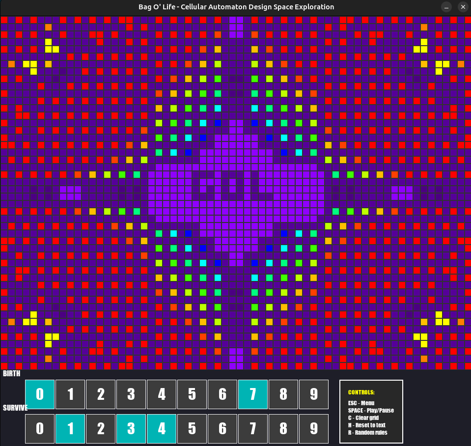

<h1 align="center">bASIC-game-of-Life</h1>

---
Bag O' Life - cellular life over HDMI  
Includes a python simulator for cellular automatons to test rules, settings and color palettes for resource limited systems (ASICs/Embedded systems)

## Controls & Hotkeys

### Keyboard Controls
- **ESC** - Open/close configuration menu
- **SPACE** - Play/pause simulation
- **C** - Clear grid (remove all cells)
- **H** - Reset grid to initial text pattern
- **R** - Randomize birth and survival rules
- **0-9** - Apply predefined rule presets (Conway's Life, HighLife, etc.)

### Mouse Controls
- **Left Click** - Add living cell to grid
- **Right Click** - Remove cell from grid

## Birth/Survival Rules

- **BIRTH** buttons control which neighbor counts cause dead cells to become alive
- **SURVIVE** buttons control which neighbor counts allow living cells to stay alive
  
values include the cell itself  
